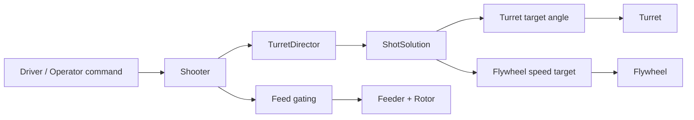
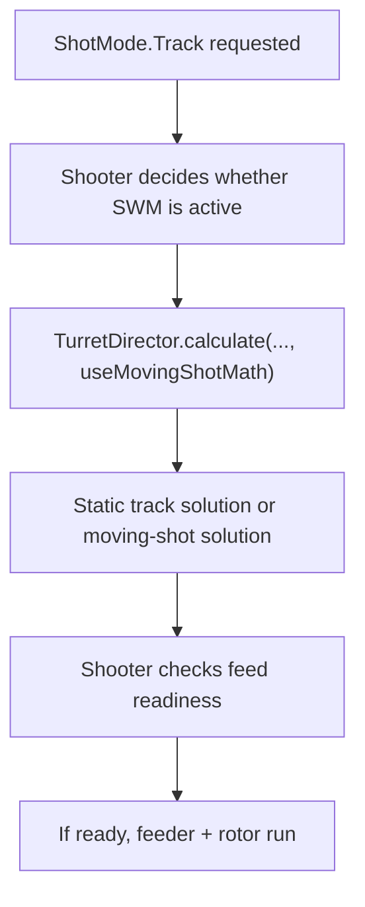

Right now, the most important thing to understand is that the shooter code is not one single blob. It is split into three layers on purpose. `Shooter` is the coordinator that owns the top-level state machine and decides when the robot is allowed to feed a note. `TurretDirector` is the math layer that figures out what shot we want right now. `Turret` is the actuator/sensor layer that reads the live turret angle and physically drives the turret to the requested angle. If those three responsibilities stay mentally separate, the code becomes a lot easier to reason about.

## How the pieces fit together

`Shooter` exists because shooting is not just “point and spin.” It has to coordinate the turret, the flywheel, the feeder, the rotor, and all of the readiness conditions that decide whether we are actually allowed to fire. That is why `Shooter` owns the high-level states like `Idle`, `Preparing`, `Ready`, `Firing`, `Manual`, and `TrackingOnly`. It is the part of the system that answers questions like “are we trying to shoot right now,” “should the feeder be running,” and “what should happen if readiness drops out in the middle of a shot.”

`TurretDirector` exists because shot calculation is a different problem from actuation. Its job is to look at the current robot state, the selected shot mode, the target geometry, and any active adjustments, and then condense that down into one `ShotSolution`. That solution includes the turret angle we want, the effective shot distance, and enough context for the rest of the shooter stack to act on it. Static aiming, moving-shot aiming, pass aiming, vision trim, and the empirical drift correction all live there because those are all part of “what shot are we trying to take,” not “how do we move the turret motor.”

`Turret` exists because it should be the only place that really cares about the live potentiometer angle, wrap handling, PID output, and lined-up reporting. In other words, `TurretDirector` should not need to know how the turret motor is controlled, and `Shooter` should not need to know how the potentiometer reading becomes a motor command. That separation is what lets us debug the system in chunks instead of trying to hold the entire subsystem in our heads at once.

## A good debugging mental model

The fastest way to debug this subsystem is to ask where the mistake first appears. If the **desired angle itself is wrong**, then the problem is usually in `TurretDirector`, because that means the shot math produced the wrong answer. If the **desired angle looks correct, but the turret is physically somewhere else**, then the problem is usually in `Turret`, because the actuation layer is not getting to the requested setpoint. If the **turret is aimed correctly and the flywheel is up to speed, but the robot still will not fire**, then the problem is usually in `Shooter`, because the feed gating or top-level state machine is what decides whether the feeder and rotor are allowed to run.

That one mental split is probably the most useful thing to keep in mind while reading the code or looking at logs.

## What happens during a normal shot

When the driver presses the normal shoot button, `Shooter.shoot()` requests `ShotMode.Track` and moves the subsystem into `Preparing`. From there, `Shooter.periodic()` keeps asking `TurretDirector` for an updated `ShotSolution`. That `ShotSolution` is used to command a turret angle and a flywheel speed. While this is happening, `Shooter` is also checking whether the various readiness gates are true. Those gates answer questions like whether the shot solution is valid, whether the turret is lined up closely enough, whether the flywheel is at speed, and whether any moving-shot constraints are satisfied. Once those conditions are satisfied, the subsystem becomes effectively ready to fire, and if auto-shoot is enabled, it transitions into the firing path. The feeder and rotor only stay on while those readiness checks continue to pass. If readiness drops, the subsystem falls back out of firing and returns to preparing.

That is why `Shooter` exists as a coordinator. The robot needs one place that can say, “yes, the math looks good, the turret is there, the flywheel is ready, and we are now allowed to feed.”

## Why `TrackingOnly` exists

`TrackingOnly` is there because aiming and firing are not the same problem. Sometimes we want to verify the turret math, the alignment behavior, or the shoot-while-moving solve without feeding a note. `TrackingOnly` keeps the targeting stack alive, keeps producing fresh shot solutions, and keeps commanding the turret, but it intentionally does not run the feeder or rotor. That makes it the safest state to use when we want to validate whether the robot is leading the target correctly or whether the turret is hunting around a setpoint.

## Where shoot-while-moving fits

Shoot-while-moving does not replace the shooter subsystem. It only changes the shot calculation that `TurretDirector` performs. `Shooter` still owns whether moving-shot math should be active, and it still owns whether we are actually allowed to feed once that moving-shot solution exists. In practice, that means SWM lives in two places conceptually. The math lives in `TurretDirector`, because that is where the lead angle and effective shot distance are calculated. The readiness logic lives in `Shooter`, because that is where we decide whether the moving-shot solution is trustworthy enough to actually fire from.

This is also why SWM can feel confusing if you only look at one class. The aiming math and the feed decision are intentionally split between two layers.

